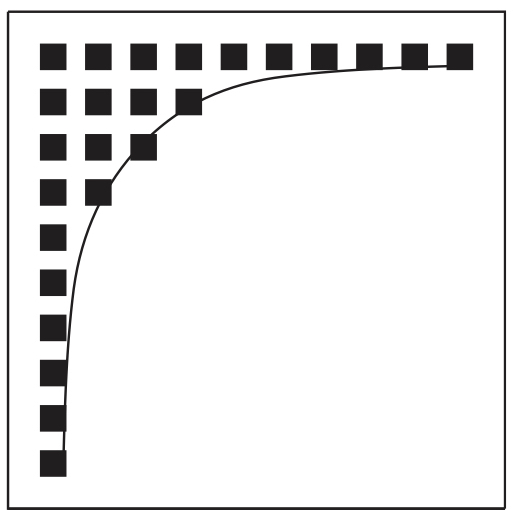
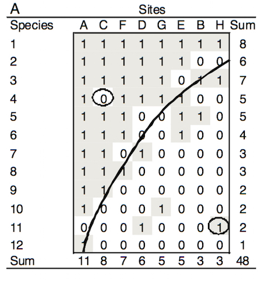
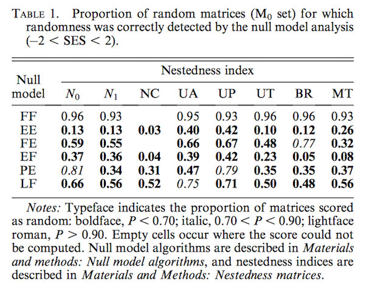
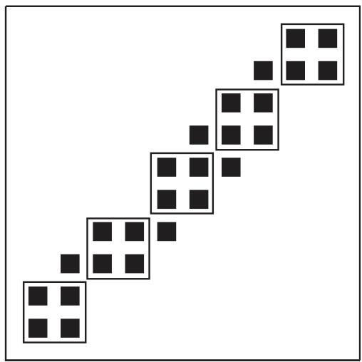
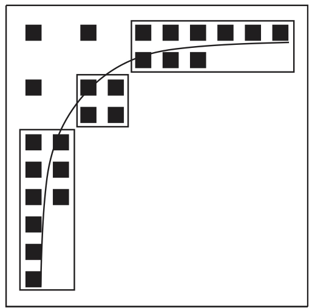

# Bipartite Networks

- Community ecology's gateway to ecological networks

<!-- Many of the tools were developed for community analyses. -->
<!-- A good example of this is null models. -->


## Base Quantities

- *L*: number of realized links in a network
- *I*: number of lower trophic
level species (e.g. plants, prey) 
- *J*: number of higher trophic level
species (e.g. pollinators, parasitoids) 
- *m*: total number of interactions for all species 
- $a_{ij}$: number of interactions between species i from the lower and
species j from the higher trophic level, also referred as “link
weight” 
- $A_i$ ($\sum_{j=1}^J a_{ij}$): total number of interactions of
species i from the ower trophic level
- $A_j$ ($\sum_{i=1}^I a_{ij}$): total number of interactions of species j from the higher
  trophic level

## Indices (Unweighted)

- Links per Species
- Connectance
- Cluster Coefficient
- Web Asymmetry
- Number of Compartments
- Extinction Slopes
- Degree Distribution
- Mean Number of Shared Hosts
- Togetherness
- C-Score
- V-Ratio
- Nestedness

## Weighted Indices

- Nestedness (WINE)
- Modularity
- Generality
- Vulnerability
- Weighted Linkage Density
- Interaction Evenness
- Interaction Strength Asymmetry
- Niche Overlap

## Weighted Indices

- **Nestedness** 
- **Modularity**
- Generality
- Vulnerability
- Weighted Linkage Density
- Interaction Evenness
- Interaction Strength Asymmetry
- Niche Overlap


# Nestedness

## <!-- Nestedness -->


## <!-- Nestedness -->



## <!-- Nestedness -->

<!-- basic idea of measuring nestedness -->
<!-- temperature -->
<!-- isocline -->
<!-- forbidden links -->



## <!-- Nestedness -->


## <!-- Nestedness -->


## <!-- Nestedness -->


## Exercise: Play with matrix ordering


## Exercise: Play with matrix ordering

```{r , results='hide'}

M <- c(rep(1,10),
        c(rep(1,4),rep(0,6)),
        c(rep(1,3),rep(0,7)),
        c(rep(1,2),rep(0,8)),
        rep(c(rep(1,1),rep(0,9)),6)
         )
M <- matrix(M,nrow=10)
rownames(M) <- paste('P',1:10,sep='')
colnames(M) <- paste('A',1:10,sep='')

```

## Exercise: Play with matrix ordering

```{r }

M

```

## Exercise: Play with matrix ordering

```{r }

M[sample(1:10,10),sample(1:10,10)]

```


## Exercise: Play with matrix ordering

```{r }

M[sample(1:10,10),sample(1:10,10)]

```

## Exercise: Play with matrix ordering

```{r }

M[sample(1:10,10),sample(1:10,10)]

```

## Testing for Nestedness

- Calculate the nestedness for a given network
- Choose an algorithm to shuffle
- Shuffle the interactions
- Calculate nestedness for the shuffled network
- Repeat a lot, like thousands of times
- Compare the observed to the "null" nestedness values

## Testing for Nestedness

```{r }
obs <- 45
null <- rnorm(1000,65,9)
hist(null,main='')
abline(v=obs)

```

## Testing for Nestedness

```{r }
z.score <- (obs - mean(null)) / sd(null)
p.value <- length(null[null <= obs])/length(null)

z.score
p.value

```


## <!-- Nestedness -->



<!-- benchmarking! -->

## Exercise: Nestedness Analysis

```{r , results='hide'}

library(bipartite)
data(Safariland)
Safariland

```

## Exercise: Nestedness Analysis

```{r , echo=FALSE}

Safariland

```

## Exercise: Nestedness Analysis

```{r }

plotweb(Safariland)

```

## Exercise: Nestedness Analysis

```{r }

plotweb(Safariland,text.rot=90)

```

## Exercise: Nestedness Analysis

```{r }

nested(Safariland)

```

## Exercise: Nestedness Analysis

```{r }

nested(Safariland,method='ALL')

```

## Exercise: Nestedness Analysis

```{r }

safari.nest <- nestedness(Safariland)
names(safari.nest)

```

## Exercise: Nestedness Analysis

```{r }

unlist(safari.nest[c('temperature')])
unlist(safari.nest[c('p.null1','p.null2','p.null3')])
unlist(safari.nest[c('mean.temp.null1','mean.temp.null2','mean.temp.null3')])
unlist(safari.nest[c('var.temp.null1','var.temp.null2','var.temp.null3')])

```


# Modularity

## <!-- Modularity -->


##


##


## <!-- Modularity -->


## <!-- Modularity -->



## Modularity

```{r , echo=FALSE,results='hide'}

if (!(('safari.mods') %in% ls())){safari.mods <- computeModules(Safariland)}

```

```{r , eval=FALSE,results='hide'}

safari.mods <- computeModules(Safariland)

```


## Modularity

```{r }
plotModuleWeb(safari.mods)

```

## Testing Modularity

```{r , echo=FALSE, results='hide'}
null.nets <- lapply(1:5,commsimulator,x=Safariland,method='r1')
if (!('null.mods' %in% ls())){null.mods <- lapply(null.nets,computeModules)}
null.stats <- lapply(null.mods,function(x) slot(x,'likelihood'))
null.stats <- unlist(null.stats)

```


```{r , eval=FALSE}
null.nets <- lapply(1:5,commsimulator,x=Safariland,method='r1')
null.mods <- lapply(null.nets,computeModules)
null.stats <- lapply(null.mods,function(x) slot(x,'likelihood'))
null.stats <- unlist(null.stats)

```

## Testing Modularity

```{r }
obs.mods <- slot(safari.mods,'likelihood')
null.mu <- mean(null.stats)
null.sd <- sd(null.stats)
null.z <- (obs.mods - null.mu) / null.sd
null.p <- length(null.stats[null.stats <= obs.mods])/length(null.stats)
null.z
null.p

```

## <!-- two sides -->



## Further reading on bipartite network analysis

- General: https://goedoc.uni-goettingen.de/goescholar/bitstream/handle/1/5837/Dormann.pdf?sequence=1
- Nestedness: https://www.uvm.edu/~ngotelli/manuscriptpdfs/UlrichConsumersGuide.pdf
- Modularity: http://arxiv.org/pdf/1304.3218.pdf
- Null Models: https://www.uvm.edu/~ngotelli/manuscriptpdfs/UlrichEcology.pdf
- Mutualistic Networks: http://press.princeton.edu/titles/10161.html


 

