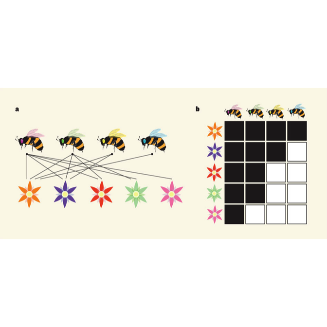
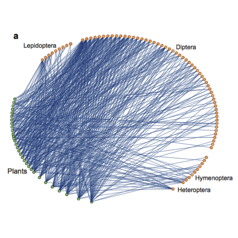
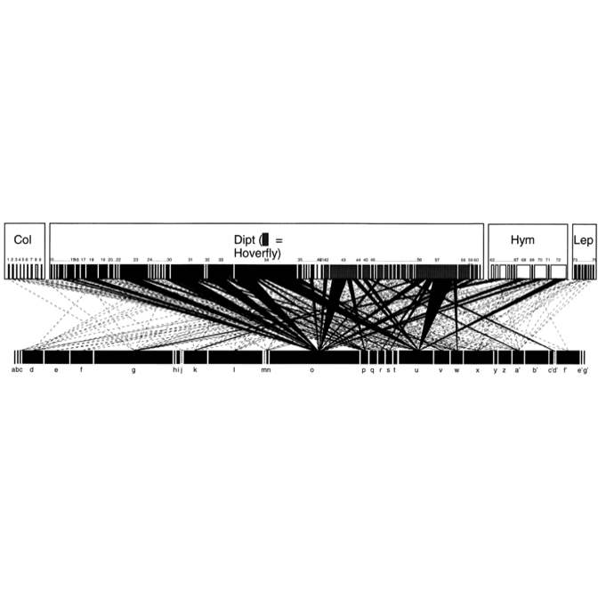
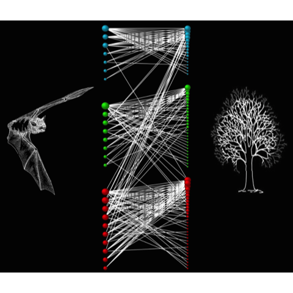
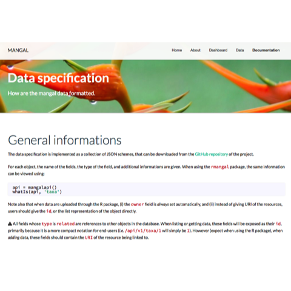
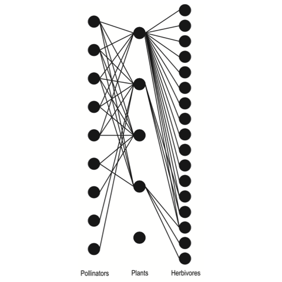
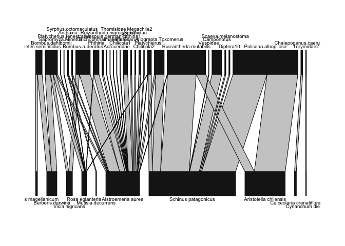
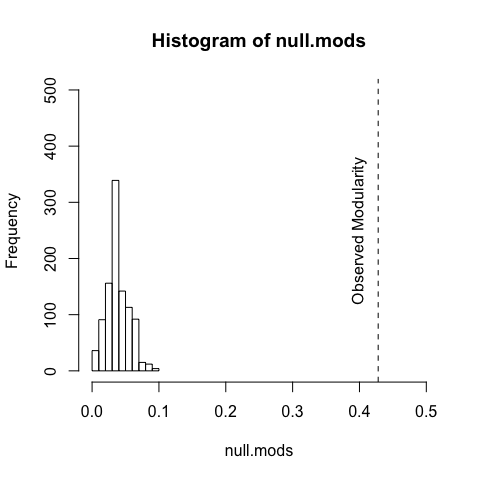

Bipartite Networks
------------------

-   What are they?
-   What are they good for?
-   How do I use them?

Bipartite Networks: What are they?
----------------------------------

*Definition:* a network in which has two sets of nodes with edges
between and not within sets.

Bipartite Networks: What are they?
----------------------------------



Bipartite Networks: What are they?
----------------------------------



Bipartite Networks: What are they?
----------------------------------



Bipartite Networks: What are they?
----------------------------------



mangal
------



<http://mangal.uqar.ca/doc/spec/>

<http://biorxiv.org/content/biorxiv/early/2015/02/24/002634.full.pdf>

Bipartite Networks: What are they good for?
-------------------------------------------

> -   Simplification (= ignore interactions within sets)
> -   Stability Theory
> -   Limitations

Bipartite Networks: Limitations
-------------------------------



Bipartite Networks: How do I use them?
--------------------------------------

Can you represent your network as two distinct sets?

Bipartite Networks: How do I use them?
--------------------------------------

"Hello, R!"
-----------

> -   Open-source
> -   Free!
> -   "Easy/Lazy" programming language

"Hello, R!"
-----------

> -   Packages
> -   CRAN
> -   GitHub

"Hello, R!"
-----------

    2+2

    ## [1] 4

"Hello, R!"
-----------

    four = 2 + 2

"Hello, R!"
-----------

    four = 2 + 2

    print(four)

    ## [1] 4

"Hello, bipartite!"
-------------------

    library(bipartite)

    ## Loading required package: vegan

    ## Loading required package: permute

    ## Loading required package: lattice

    ## This is vegan 2.3-3

    ## Loading required package: sna

    ## sna: Tools for Social Network Analysis
    ## Version 2.3-2 created on 2014-01-13.
    ## copyright (c) 2005, Carter T. Butts, University of California-Irvine
    ##  For citation information, type citation("sna").
    ##  Type help(package="sna") to get started.

    ##  This is bipartite 2.05
    ##  For latest changes see versionlog in  ?"bipartite-package".
    ##  For citation see: citation("bipartite").
    ##  Have a nice time plotting and analysing two-mode networks.

    ## 
    ## Attaching package: 'bipartite'

    ## The following object is masked from 'package:vegan':
    ## 
    ##     nullmodel

bipartite: models
-----------------

Import/Load models using read.csv

**people.fas.harvard.edu/~matthewklau/bipmodel.csv**

bipartite: models
-----------------

<!-- ```{r } -->
<!-- data(vazarr) -->
<!-- write.csv(vazarr,file='../data/bipmodel.csv') -->
<!-- ``` -->
    our.binet <- read.csv('../data/bipmodel.csv')

bipartite: nestedness
---------------------


bipartite: nestedness
---------------------

    binet.nest <- nestedness(our.binet,null.models=FALSE)
    names(binet.nest)
    binet.nest$temperature

bipartite: nestedness
---------------------

    binet.nest <- nestedness(our.binet,null.models=TRUE,n.nulls=10)

bipartite: nestedness
---------------------

    plotweb(our.binet)

<!-- -->

bipartite: modularity
---------------------


bipartite: modularity
---------------------

    binet.mods <- computeModules(our.binet)

    binet.mods

    plotModuleWeb(binet.mods)

bipartite: modularity
---------------------

    null.nets <- nullmodel(our.binet, N=1000, method="r2d")

    null.mods <- lapply(null.nets,computeModules)

    null.mods <- lapply(null.mods,slot,name='likelihood')

bipartite: modularity
---------------------



bipartite: modularity
---------------------

Caclulate z-value and p-value for right-tailed test:

    obs.mods <- slot(obs.mods,name='likelihood')

    null.mods <- unlist(null.mods)

    z.val <- (obs.mods - mean(null.mods)) / sd(null.mods)
    z.val

    ## [1] 22.76959

    p.val <- length(null.mods[null.mods >= obs.mods]) / length(null.mods)
    p.val

    ## [1] 0


What does it all mean?
----------------------

-   Structural analysis with dynamic implications
-   Nestedness minimizes competition and facilitates diversity
-   Modularity stabilizes through compartmentalization

What does it all mean?
----------------------

Bascompte J. and Jordano P. 2014. [Mutualistic
networks](http://press.princeton.edu/titles/10161.html). Prineton
University Press.

Fortuna M.A. et al. 2010. [Nestedness versus modularity in ecological
networks: two sides of the same
coin?](https://scholar.google.es/citations?view_op=view_citation&hl=en&user=Pvl3sY0AAAAJ&sortby=pubdate&citation_for_view=Pvl3sY0AAAAJ:9yKSN-GCB0IC).
J. Anim. Ecol., 7:811-817.

Gotelli N.J. and Ellison A.M. 2013. [Primer of Ecological
Statistics](http://www.sinauer.com/a-primer-of-ecological-statistics.html).
Sinauer Associates, Inc.

Bluthgen N. et al. 2008. [What do interaction network metrics tell us
about specialization and biological
traits?](http://tubiblio.ulb.tu-darmstadt.de/54492/). Ecology, 89:
3387-3399.

Fontaine et al. 2011. [Stability of ecological communities and the
architecture of mutualistic and trophic
networks](https://scholar.google.com/citations?view_op=view_citation&hl=fr&user=DWKgfuUAAAAJ&citation_for_view=DWKgfuUAAAAJ:Tyk-4Ss8FVUC).
Ecol. Lett., 14: 1170-1181.

Connect: The R network world
----------------------------

**Other Network Packages**

-   *sna*
-   *network*
-   *statnet*
-   *igraph*
-   *Rgraphviz*
-   *vegan*

Connect: enaR to EcoNet
-----------------------

This function will right a network class model to a text file formatted
for *EcoNet*.

    data(oyster)
    write.EcoNet(oyster,file='./oyster.txt',mn='ena_model_oyster')
